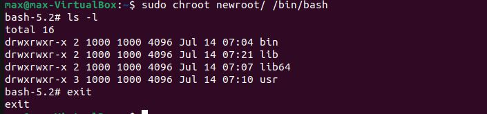
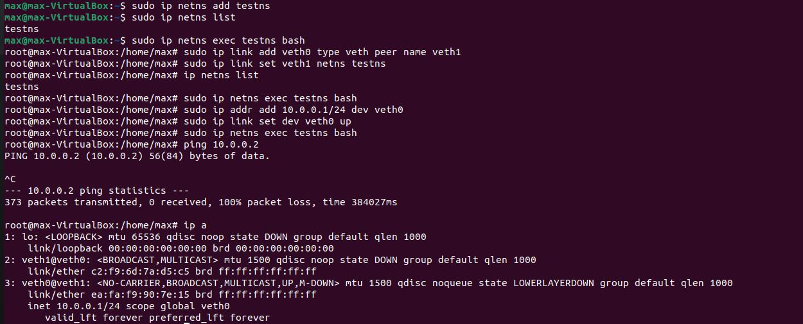

# Урок 1. Механизмы пространства имен

## Сделать chroot для /bin/bash и перенести в новй корень программу ls - Хорошо

```
max@max-VirtualBox:~$ mkdir -p newroot/bin
max@max-VirtualBox:~$ cp /bin/bash ./newroot/bin
max@max-VirtualBox:~$ ldd /bin/bash
	linux-vdso.so.1 (0x00007fffc6b8f000)
	libtinfo.so.6 => /lib/x86_64-linux-gnu/libtinfo.so.6 (0x00007fd749889000)
	libc.so.6 => /lib/x86_64-linux-gnu/libc.so.6 (0x00007fd749600000)
	/lib64/ld-linux-x86-64.so.2 (0x00007fd749a33000)
max@max-VirtualBox:~$ mkdir newroot/lib
max@max-VirtualBox:~$ mkdir newroot/lib64
max@max-VirtualBox:~$ cp /lib/x86_64-linux-gnu/libtinfo.so.6 newroot/lib
max@max-VirtualBox:~$ cp /lib/x86_64-linux-gnu/libc.so.6 newroot/lib
max@max-VirtualBox:~$ cp /lib64/ld-linux-x86-64.so.2 newroot/lib64
max@max-VirtualBox:~$ mkdir usr
max@max-VirtualBox:~$ sudo chroot newroot /bin/bash
[sudo] пароль для max: 
bash-5.2# exit
exit
max@max-VirtualBox:~$ whereis ls
ls: /usr/bin/ls /usr/share/man/man1/ls.1.gz
max@max-VirtualBox:~$ mkdir newroot/usr
max@max-VirtualBox:~$ mkdir newroot/usr/bin
max@max-VirtualBox:~$ cp /usr/bin/ls newroot/usr/bin
max@max-VirtualBox:~$ sudo chroot newroot /bin/bash
bash-5.2# 
bash-5.2# ldd /usr/bin/ls
bash: ldd: command not found
bash-5.2# exit
exit
max@max-VirtualBox:~$ 
ldd /usr/bin/ls
	linux-vdso.so.1 (0x00007ffc7971f000)
	libselinux.so.1 => /lib/x86_64-linux-gnu/libselinux.so.1 (0x00007fdc817b5000)
	libc.so.6 => /lib/x86_64-linux-gnu/libc.so.6 (0x00007fdc81400000)
	libpcre2-8.so.0 => /lib/x86_64-linux-gnu/libpcre2-8.so.0 (0x00007fdc8171a000)
	/lib64/ld-linux-x86-64.so.2 (0x00007fdc81816000)
max@max-VirtualBox:~$ cp /lib/x86_64-linux-gnu/libselinux.so.1 newroot/lib/
max@max-VirtualBox:~$ cp /lib/x86_64-linux-gnu/libc.so.6 newroot/lib/
max@max-VirtualBox:~$ cp /lib/x86_64-linux-gnu/libpcre2-8.so.0 newroot/lib/
max@max-VirtualBox:~$ cp /lib64/ld-linux-x86-64.so.2 newroot/lib64/
max@max-VirtualBox:~$ sudo chroot newroot/ /bin/bash
bash-5.2# ls -l
total 16
drwxrwxr-x 2 1000 1000 4096 Jul 14 07:04 bin
drwxrwxr-x 2 1000 1000 4096 Jul 14 07:21 lib
drwxrwxr-x 2 1000 1000 4096 Jul 14 07:07 lib64
drwxrwxr-x 3 1000 1000 4096 Jul 14 07:10 usr
bash-5.2# exit
exit
```



---

## 2) Повторить последовательнсть комманд с ip как на семинаре. - Отлично

```
max@max-VirtualBox:~$ sudo ip netns add testns
max@max-VirtualBox:~$ sudo ip netns list
testns
max@max-VirtualBox:~$ sudo ip netns exec testns bash
root@max-VirtualBox:/home/max# sudo ip link add veth0 type veth peer name veth1
root@max-VirtualBox:/home/max# sudo ip link set veth1 netns testns
root@max-VirtualBox:/home/max# ip netns list
testns
root@max-VirtualBox:/home/max# sudo ip netns exec testns bash
root@max-VirtualBox:/home/max# sudo ip addr add 10.0.0.1/24 dev veth0
root@max-VirtualBox:/home/max# sudo ip link set dev veth0 up
root@max-VirtualBox:/home/max# sudo ip netns exec testns bash
root@max-VirtualBox:/home/max# ping 10.0.0.2
PING 10.0.0.2 (10.0.0.2) 56(84) bytes of data.
^C  
--- 10.0.0.2 ping statistics ---
373 packets transmitted, 0 received, 100% packet loss, time 384027ms
root@max-VirtualBox:/home/max# ip a
1: lo: <LOOPBACK> mtu 65536 qdisc noop state DOWN group default qlen 1000
    link/loopback 00:00:00:00:00:00 brd 00:00:00:00:00:00
2: veth1@veth0: <BROADCAST,MULTICAST> mtu 1500 qdisc noop state DOWN group default qlen 1000
    link/ether c2:f9:6d:7a:d5:c5 brd ff:ff:ff:ff:ff:ff
3: veth0@veth1: <NO-CARRIER,BROADCAST,MULTICAST,UP,M-DOWN> mtu 1500 qdisc noqueue state LOWERLAYERDOWN group default qlen 1000
    link/ether ea:fa:f9:90:7e:15 brd ff:ff:ff:ff:ff:ff
    inet 10.0.0.1/24 scope global veth0
       valid_lft forever preferred_lft forever

```


