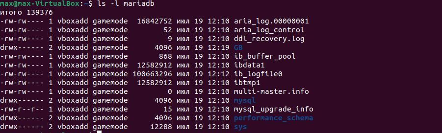

# Урок 3. Введение в Docker

## Задание:

### 1. Запустить контейнер с БД mariaDB, используя инструкции на сайте hub.docker.com.

### Слинковать папку с базой данных с контейнера с mariaDB в папку на хосте (как на семинаре). Заполнить БД данными или добавить запись и проверить, что файлы базы данных появились на хостовой машине.

```sh
mkdir mariadb
docker run --name mariadbGB -v ~/mariadb:/var/lib/mysql  -e MYSQL_ROOT_PASSWORD=GB -p 3306:3306 -d mariadb:10.10.2
docker ps
docker exec -it ea mysql -u root -p
```


---

MySQL:

```sql
show databases
create database GB
```


```sh
ls -l mariadb
```



### 2. Запустить phpmyadmin (в контейнере) и через веб проверить, что все введенные данные доступны. http://localhost:8081/

```sh
docker run --name phphmyadmin -d --link mariadbGB:db -p 8080:80 phpmyadmin/phpmyadmin
docker ps
```

